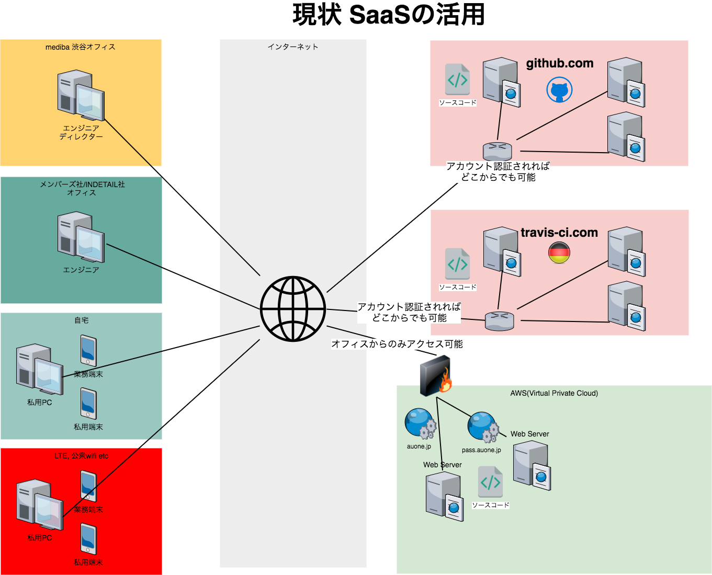
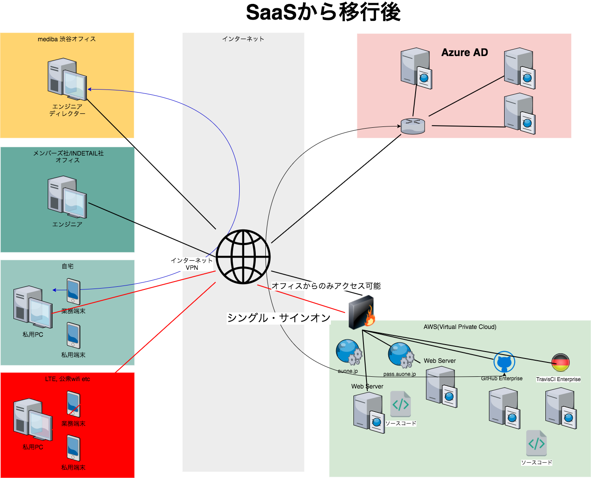
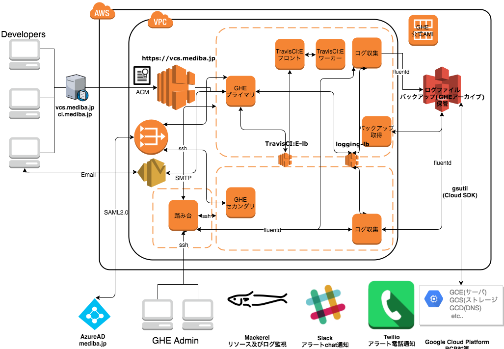
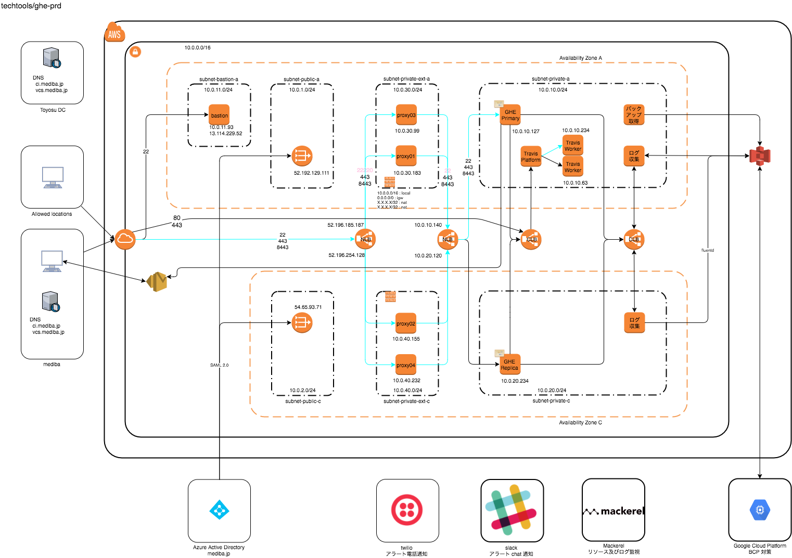

# 自己紹介

- [株式会社mediba](https://www.mediba.jp/services.html)のエンジニア
	- インフラ部所属
	- DevOps推進のミッション
- Node.js/Golang/PHP etc..
	- 最近はもっぱら管理職..
- GHE歴は、ちょうど1年

# GHE導入経緯

- KDDIグループ各社に対するセキュリティ強化の大号令
	- ソースコードをセキュアな環境で管理する
	- 操作履歴を監視、ログ出力、保管する
	- シングル・サインオン(SSO)を実現し、アカウント管理をセキュアに実施する
- プロジェクトを通して達成したい目標
	- 開発基盤を自らの手で構築、メンテナンスすることで、若手エンジニアの育成を図る
	- SSOの実現により、アカウント管理を容易にする
	- DevOpsの観点でチーム開発の可視化を図る

# GHE導入経緯 Before

- SaaS利用時の課題を整理

# GHE導入経緯 After

- インフラは、AWSをメインとしました。

# GHE導入経緯

- 構築期間: 2ヶ月
- 移行期間: 1年
	- リポジトリ数: 約250
	- アカウント数: 150
- 運用体制
	- ディレクター: 北田
	- 担当者(兼務): 1名

# 経験談 ファイアーウォールどうしよう

- Security Group(SG)のインバウンドルール数のハードリミットに達する
	- 250個/VPC のハードリミット
	- 導入後半年で達する...

# 経験談 ファイアーウォールどうしよう

- 構築期間: 2ヶ月
- 移行期間: 1年
- NLB + firewalldでファイアーウォールを構成
	- SGのルールをfirewalldの設定ファイルに移植
	- NLBを二段構成
		- 前段NLBでSource IP Addressを特定した上、firewalldが稼働しているEC2インスタンスにリクエストを転送
		- firewalldにてSource IP Addressを判定、設定済みのアドレスであれば、後段NLBに転送
		- 後段NLBがGHE稼働インスタンスにリクエストを転送
	- SSLの終端は、GHE稼働インスタンスにて実施

# 経験談 GHEのバージョンアップどうしよう

- バージョンアップのリリースがあり次第、1週間以内に実施
	- SlackにてRSSを取得、毎朝確認
	- 業務開始前の1~1.5時間で実施
- リリース後にセキュリティfixによるマイナーバージョンアップが頻発...
- 現在は、リリース1週間を様子見期間として、2週間後に実施

# 経験談 リポジトリのマイグレーションが結構泥臭い

- もっと簡単にマイグレーションできると思ってました(爆
- 手順書を作成し、開発チームと連携しながら、コツコツマイグレ中

# まとめ

- お金と手間がかかるが、想定内
	- 運用担当者は、兼任でもOK
	- とはいえ、稟議は大変(T_T)
- 内製開発のスキルアップに貢献出来ている
	- 新卒のOJTにも活用
- コントローラブルなので、技術的な挑戦がしやすい
	- firewalldの商用投入は、未経験だったが安定稼働中
	- 次の期は、BCP対策としてマルチクラウドを実践予定
